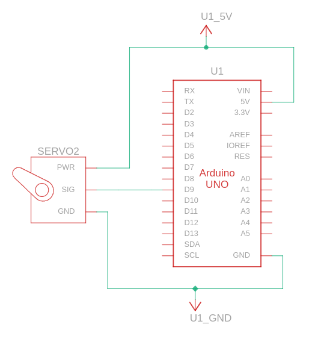

# SmartGate: Automated Gate Control with Face and License Plate Recognition
SmartGate is a client-server application that automates gate control by recognizing faces and license plates. When a familiar face or license plate is detected, a signal is sent to a Raspberry Pi client that sends another signal to an Arduinp UNO to open the gate by controlling a servomotor.

## Mobile Application Integration
In addition to the core client-server functionality, we are developing a mobile application that allows users to manage faces and license plates remotely from a third device, such as a smartphone. The app will enable you to add new faces and license plates directly to the server database, with future plans to support removal and editing as well.

Further features will be introduced, such as user group management, access control, and more. Stay tuned for updates, and find the mobile app repository here: [[https://github.com/Nikkio083/SmartGateApp]].
## Features
- Real-time face recognition using a database of known faces.
- License plate recognition using Google Cloud Vision API.
- Automated gate control: Upon recognizing a known face or license plate, the client triggers a servomotor to open the gate.
- Webcam capture: The client captures images at regular intervals and sends them to the server for processing.

## Requirements
### Client-Side (Raspberry Pi)
- Python 3.x
- OpenCV (cv2)
- Requests library (requests)
- Serial library for controlling the Raspberry Pi's servomotor
- A webcam connected to the Raspberry Pi
- An Arduino UNO connected to the Raspberry Pi
- A connected servomotor for gate control
### Server Side
- Python 3.x
- Flask
- OpenCV
- Numpy
- Face_recognition
- Google Cloud Vision API
-  A Google Cloud credentials file 

## Installation
1. Clone the repository:
   ```bash
   git clone https://github.com/k0m1d3v/SmartGate.git
   cd SmartGate
   ```
2. Install the required Python libraries:
   ```bash
   pip install -r requirements.txt
   ```
3. Set up your Google Cloud credentials:
   - Ensure you have your GOOGLE_APPLICATION_CREDENTIALS file, and set the environment variable
   ```bash
   export GOOGLE_APPLICATION_CREDENTIALS="path_to_your_json_file.json"
   ```
4. Add known faces:
   - Place images of known faces in the known_faces folder. Supported formats: .jpg, .png, .jpeg.
5. Set up the Arduino UNO for GPIO control:
   - Connect the Arduino UNO to the Raspberry Pi and flash it with the code in the "Cancello" directory
   - Ensure the servomotor is correctly connected.
## Hardware Setup
The following diagram illustrates the connection between the Arduino UNO and the servomotor:



In this setup:
- The Arduino UNO is connected to the Raspberry Pi
- The 5V pin of the Arduino UNO is connected to the + of the servo motor.
- The GND pin is connected to the ground of the servo motor.
- A GPIO pin (e.g., GPIO 9) is connected to the control input pin of the servo.
## Usage
### Running the server
1. Navigate to the server directory and run:
```bash
python server.py
```
The Flask server will start listening on port 5000.
### Running the client
1. Run the client on your Raspberry Pi to start capturing images and control the gate:
```bash
python client.py
```
2. The client captures webcam frames and sends them to the server. When the server recognizes a known face or license plate, a signal is sent back to the client, which then activates the servomotor to open the gate.
## How It Works
- Client: Captures webcam images using OpenCV and sends them as JPEG-encoded files to the Flask server via HTTP POST requests. The client also listens for responses from the server to control the gate.
- Server: Processes the images to detect faces using face_recognition and license plates using Google Vision. If a recognized face or license plate is found, the server sends a command back to the client to open the gate.
### License Plate Detection
Google Vision API is used to perform text detection on images to extract license plate numbers. Text is filtered to keep only alphanumeric characters that are enclosed in a rectangular/squared field.
### Gate Control
The Raspberry Pi client controls a servomotor via its GPIO pins. When the server detects a known face or license plate, the client receives a signal and activates the motor to open the gate.
### To-Do
- Improve recognition accuracy.
- Add more sophisticated error handling for Google Cloud API requests.
## License
This project is licensed under the MIT License.
